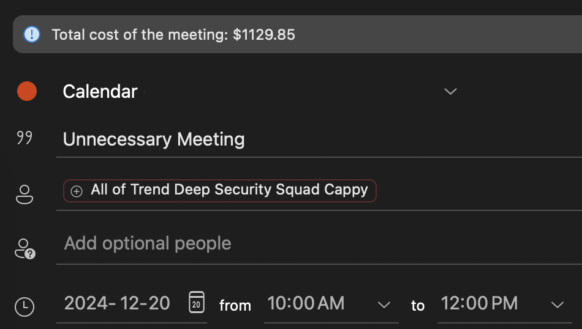

# Meeting Cost Outlook Add-in

This repository contains an add-in for Microsoft Outlook that will determine the cost of a meeting based on the job titles of the individuals invited using normalized salary data. Whenever the meeting details are changed, the cost estimation will be calculated and displayed on an InfoBar during scheduling.

The add-in `It Could Have Been an Email` will help reduce unnecessary meetings by demonstrating the cost of having all the participants busy for that alloted amount of time.



## Installing the Add-in

### Sideload in Outlook

The steps to install this add-in are very simple using the Office sideload method.

1. In Outlook, click the `...` button in the ribbon to expand for additional options.
2. Select the `Get Add-ins` button to open the Add-ins menu.
3. On the navigation bar select the `My add-ins` option.
4. Scroll down to the `Custom Addins` section and select `+ Add a custom add-in` -> `Add from file`.
5. Select the correct `manifest.xml` file from this repository (more details on which to select later)

The add-in should now be installed as demonstrated below.


### Hosting the Add-in

The function code of the add-in must be hosted in a web server, which is specified in the `manifest.xml`. This is how the add-in will be able to run, otherwise it will fail as there is no source code delivered with the manifest.

The source for this webserver is written with Node and is hosted in this repository as well. The `package.json` specify the required dependencies, and the `src` directory contains all the function code.

There are two options for hosting to be able to deliver this content to Outlook.

#### Localhost (Development)

The `manifest-localhost.xml` demonstrates how to configure the add-in to use the function code on the same machine. To use this method, first ensure that the `manifest-localhost.xml` was installed, and `node`/`npm` is also installed on the local machine. Then run the command:

```bash
npm run dev-server
```

This will start a webserver on port 3000 in the local machine. The add-in should now function correctly in Outlook. If there is a current meeting open, it will need to be closed and reopened. While the webserver is running, each time the function code is saved, it will automatically recompile without needing to restart the server.

> This method is only useful for running the add-in on a single machine

#### Webserver (Production)

For widespread use of the add-in, a centralized web host must be setup. There is a wide range of possible setups. The only requirement is that the `html` files in this repository are hosted (with JavaScript enabled), and the `asset` files are also available. To build the webserver package, run the command:

```bash
npm run build
```

The `manifest.xml` file is an example of the add-in with a dedicated webserver host. An working version of this content is hosted in the GutHub pages for this repository. This file will need to be modified to have all the `URLs` changed to the webserver in your organization if a dedicated host is created.

## Booking Meetings with the Add-in

Once the add-in is installed and hosted, it is ready to use. Simply start booking a meeting in the calendar and setup the meeting details. Any time the meeting attendees or the duration is changed, the meeting cost will update.

There is also a button added to the ribbon that can be used to refresh the cost notification at any time.

> Note: There may be a slight delay between when changes are made and while the add-in completes its calculation

### Supported Features

Below are some of the features that the add-in currently supports:

* Distribution List (DL) expansion
* Configurable job titles and salaries
* Cost calculated on Required and Optional attendees

### Configuration

Due to confidentiality with salaries, there is no support for HRIS integration to pull true salary data. Instead, we use normalized salary data for specific job titles. Since salary and titles are specific to each region and company, this will need to be configured for each organization. 

The `src/salary.js` file is where this configuration is completed. 

## Troubleshooting and Debugging

Add-ins require special steps to be able to debug and see logs. This section will outline how to debug the two main add-in sections.

### Manifest

If the `manifest.xml` has any issues when it is sideloaded into Outlook, there will not be a clear error message. Instead Outlook will just state that the installation cannot be completed at this time and provide no additional information. To get some error output and validate that the XML is the problem, use the command:

```bash
npm run validate
```

This will validate the XML and check that it describes a functional Office add-in. There are unfortunately still some cases where the validator will pass but the add-in cannot be installed.

### Function Code

When the add-in runs, it will not display any logs inside the web server. Instead logs are displayed in a local web console, but only if that interface is visible. To enable the local web interface, run the command:

```bash
defaults write com.microsoft.Outlook OfficeWebAddinDeveloperExtras -bool true
```

After executing the command, Outlook will need to be restarted. Now when the add-in executes, it will open a blank web browser window with the name of the plugin. Right click in this window and select `Inspect element`. That will open the browser's inspect menu, where you can navigate to the `Console` tab. This will have the output of any `console.log()` statements.

Once debugging is complete, the local web interface can be disabled. To do this, run the command below and then restart Outlook.

```bash
defaults delete com.microsoft.Outlook OfficeWebAddinDeveloperExtras
```
